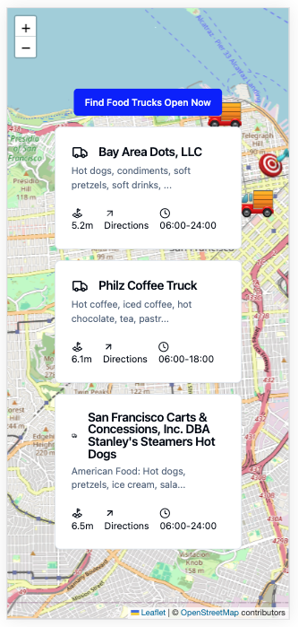
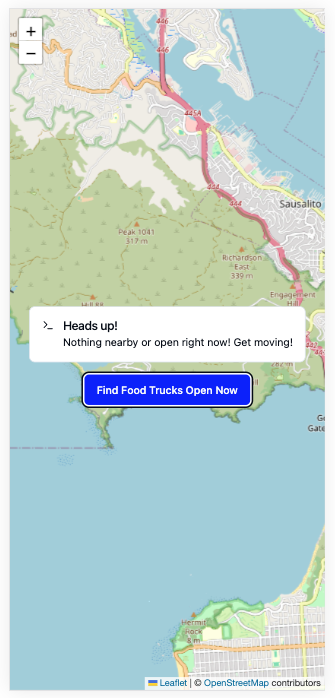
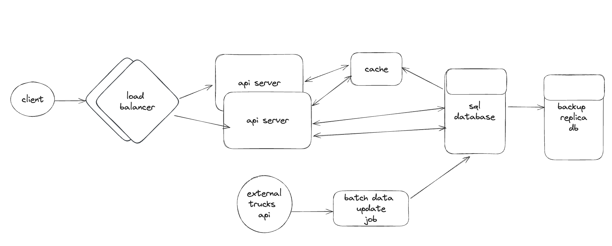

# rolling-stove

Rolling Stove is a food truck discovery app - the easiest way to find nearby food trucks open right now within a 5 radius of your current location!




## Packages

This monorepo is managed with Lerna and NPM workspaces.

* client - Mobile-responsive front-end written in Typescript using React
* server - API server written in Typescript using ExpressJS

## Local development

Install the dependencies and run the client and server locally:

```
npm install
npm run dev
```

The server will be running on `http://localhost:5173/` and client on `http://localhost:8080`. Open the client url in a browser to try out the app.

You can also test the API server via `curl`:

```bash
curl --request GET 'http://localhost:8080/ping'
```

This should return a `Hello, World!` JSON response if the server is up and running: `{"message":"Hello World!"}`.

### Adding new npm packages

To add a new dep to a package, use the `-w` flag to specify the workspace. Run this command from the project root directory.

```bash
npm install <dep-name> -w rolling-stove-client
```

### Tests

Run the client and server unit tests

```bash
npm run test
```

### Linting and Formatting

Format and lint both packages

```bash
npm run format
npm run lint
```

## Architecture

Rolling Stove uses a client-server architecture. The application is currently "read-only". Updates to the food truck data may be done ad-hoc, as needed (e.g. using schedule jobs).

The apps's current architecture supporting the following user stories:

### User Stories
* [x] As a user, I can see my current location centered on an zoomable map
* [x] As a user, I can click a button to search for the three nearest food trucks open right now (and view the results without scrolling)
* [x] As a user, I can click a food truck result and have the map zoom to the food trucks location
* [x] As a user, I can click "Directions" to get directions to a selected food truck from my current location

### Server

#### Tech Stack
* Express.js
* Typescript
* NPM

#### Functional Features
* [x] In-memory "database" of San Francisco food trucks (scraped from [API](https://dev.socrata.com/foundry/data.sfgov.org/jjew-r69b))
* [x] RESTful JSON API to search food trucks by:
    - Current day of week
    - Whether it is open right now
    - With response sorted by "haversine" distance from user's current location (returning up to 3 results, restricted to a 5 mile radius)

#### Technical Features
* [x] Testing with Jest and Supertest
* [x] Request validation and error-handling
* [x] Cross-Origin Resource Sharing enabled using cors
* [x] Secured HTTP Headers using helmet

### Potential Future Features

####  Functional 
* [ ] Improved searching and filtering (e.g. cuisines, future dates)
* [ ] User registration and management (to provide value-add features)
* [ ] Value-add features (e.g. ratings, favorites)
* [ ] "Real-time" (or regular) updates to the trucks data

#### Technical
* [ ] Logging (e.g. winston)
* [ ] Environment variables (e.g. dotenv)
* [ ] Response compression
* [ ] Containerization for deployment
* [ ] Add SQL database with geospatial query capabilities
* [ ] Devise relational data model for trucks, locations, users.
* [ ] Caching

### Client

#### Tech Stack

* React
* Typescript
* Vite
* Leaflet

#### Functional Features
* [x] Zoomable + pannable map
* [x] Big blue centered button to request nearby food trucks
* [x] Clickable links to Google Maps walking directions

#### Technical Features
* [x] Testing with Jest and Supertest
* [x] Alerting of errors and issues to user

### Future Features

####  Functional 
* [ ] Value-add features (e.g. filtering, changing search radius, changing date)
* [ ] Additional accessibility features (e.g. ability to choose which Google Maps directions you want - right now it defaults to walking)

#### Technical
* [ ] Factor App component into more components for improved testability

### Monorepo

Additionally, there are some developer productivity and code quality improvements I'd like to consider for the overall monorepo:

#### Future Technical Features

* [ ] Shared types between client and server (managed by Lerna)
* [ ] Git Hooks for pre-commit linting
* [ ] CI automation (testing, linting, etc)
* [ ] Observability / monitoring tooling and integration

### Discussion Topics

As this was a fun toy project, there are many potential next steps and considerations on its path forward.

## Shortcuts and Tradeoffs

### Data model and database

Notably, the major shortcut I took here was not setting up a proper database or data model for the truck data. I scraped the data and loaded the data into memory, marshalling into a typed structure. Given that there are only 1k trucks in the dataset, it's a read-only use case, and only running locally, this was a reasonable trade-off to make for agility.

As we consider future value-add features and user requirements, this would influence the data models we require. Ideally, with these requirements, we could consider which databases offer useful features (e.g. geospatial queries)

### Haversine

I did not have time to research the Haversine equation as much as I would like, so I elected to use a popular npm package. This would be something we'd want to understand deeply with more time.

### Testing, PRs, etc

There are a number of developer workflows and testing patterns that would be essential to add to improve productivity and maintainability of our app. While testing was introduced to this repo, coverage is still low.

## Productionization

Given its current read-only, low-volume usage pattern, it would be possible to deploy this toy application to a cloud service with a few essential improvements, including:

* Environment variables + config management
* Proper CORS handling
* CI / Deployment / Domain setup + HTTPS
* Deployment documentation

However, we should always be planning for scale and security. At a minimum, we would want: 

* Rate limiting
* Caching (e.g. redis)
* Load balancing
* Server redudancy + horizontal scaling
* Data backups
* Monitoring / metrics / observability / logging

Using a reverse proxy (like NGINX) in our deployment, we could hit several of these scale and safety goals (e.g. rate limiting, load balancing, logging).

In the upcoming section, I'll discuss the top user features to build if this app were to scale nation-wide with 100k food trucks in 1k cities. This is a high-level arch diagram of the system I would suggest for a low-latency, reliable, available service.



* We have two API servers (handling up 50k concurrent connections each) behind load balancers
* Our API servers will check a cache first, and hit the database otherwise
* We have a proper relational database with geospatial query functionality (e.g. Postgres)
* Separately, we have a batch truck updater that runs X times per day to update the truck data from the external API service (with rate limiting to ensure we stay in compliance)

## Key Features for Nation Wide Launch

The two product features I see as essential for a nation-wide rollout are *More Search Capabilities with More Data* and *Supporting User Input and Mutability*

For *More Search Capabilities*, users will want to be able to filter for many different characteristics of the food trucks, like cuisine type. They may want to adjust our default assumptions (e.g. max 5 mile radius, only 3 results, or adjust the hours). They may also want to track a single truck over several days in case they missed it. There are all sorts of fun patterns that may emerge from customer research, and customer research will be essential here. Then, we will need to define our key data models (e.g. `truck`, `user`, `location`, etc), and then set up a SQL database to support these queries scalably. We may need to find new sources for the data we want to display, because it may not be there in the original API.

For *Supporting User Input and Mutability*, users will expect to able to interact with this app and save their progress/notes/reviews. This is now table-stakes for most successful applications. At the moment, our app is read-only. I would advocate for user-registration, with the ability to develop key value-add features for users (e.g. preferences, saved searches, reviews). This is also important for safety features (e.g. users may want to "mute"/remove certain food truck vendors from their results).